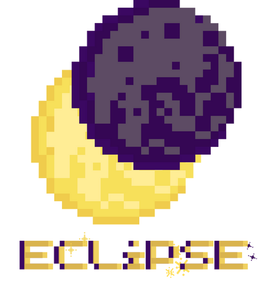

 

# Eclipse - Command Your Army in a Battle of Light and Darkness

[Now available on itch.io](https://pots-and-pans.itch.io/eclipse)

Deploy hidden-rank warriors, master tactical deception, and capture the enemy Crystal in this turn-based strategy game.
Command an army of 40 units in cosmic warfare against the Darkness or challenge friends in LAN multiplayer.

### A game of Imperfect Information

*The battlefield lies shrouded in mystery. Every piece conceals its true power. One wrong move could cost you everything.*

Light vs Shadow - which side will prevail?*

## Installation

### Windows
1. Download the `.zip` file from the [releases page](https://github.com/vlshields/Eclipse/releases/)
2. Extract the archive to your preferred location
3. Double-click `eclipse*.exe` to launch the game

### macOS
1. Download the `.zip` file from the [releases page](https://github.com/vlshields/Eclipse/releases/)
2. Extract the archive to your applications folder
4. Right-click `Eclipse.app` and select "Open"
5. A warning will appear stating that Eclipse isn't from the App Store. To bypass this, go to settings -> privacy and security click "Open" to run anyway
   - You only need to do this the first time you launch the game

### Linux / Universal
1. Download the .love file from the [releases page](https://github.com/vlshields/Eclipse/releases/)
2. Run with: `love eclipse*.love`. On windows you may have to include the .exe extenion: `love.exe eclipse*.love`

## Contributing

The best way to contribute is to play the game and provide feedback! This game has become a bigger project than was first intended. It has become increasingly difficult to identify every bug or potential area of improvement. Please see the [issues](https://github.com/vlshields/Eclipse/issues) page for known issues and to file your bug report or feature request. Be sure to tag a feature request with "enhancement". Any open issue will be responded to and every feature request/suggestion will be consitered!

#### Help Wanted
Please see [existing issues](https://github.com/vlshields/Eclipse/issues) tagged with "Help Wanted" for items in particular need of player feedback.
Also, please feel free to add sections (strategies, troubleshooting, etc) to the [new wiki!](https://github.com/vlshields/Eclipse/wiki)

## About Online Multiplayer

The driving factor for creating this game was to recreate a board game-like experience. The idea is that having a "board game" that fits inside of your laptop is much more portable than carying around a big box. My goal was to get as close to that feeling of competitive friend/family time as possible. In spirit of that, Eclipse's Online Multiplayer mode does not connect to a seperate remote server that allows players to connect over WAN. It is also stripped of other teltale Online Multiplayer features, such as a chat (voice or text). Players are meant to connect over LAN (Local Area Network). In other words, you have to be on the same network as your openent. The player that choses to host the game will both run a local server and connect to it. The host can then share the provided game code with a friend for battle!

**Important: Do not expose your port to the internet**

While it is possible of course, it is absolutely not safe. If you must play someone remotely look into VPN services like [Tailscale](https://tailscale.com/) or [WireGuard](https://www.wireguard.com/) 

## Bug Reports & Feature Requests

Please check [existing issues](https://github.com/vlshields/Eclipse/issues) before submitting new ones. When reporting bugs, include your operating system and Eclipse version as well as Screenshots or error messages if applicable.

## Development Updates

The official Beta Release is out now! That means that the game seems stable enough to be distributed to the wider public and development versions will be different than the stable releases. That also means that there won't be any game changing features added; the priority will be fixing bugs and responding to user feedback. Thats not to say that players are no longer encouraged to request new features - there will still be updates. The more feedback there is the better! Thank you to all the people who have helped test the game thus far, it is a small group and you all mean so much to me. 

## Acknowledgements

- **Engine:** Built with [LÖVE](https://love2d.org/)
- **Graphics:** Created using Canva and [Aseprite](https://www.aseprite.org/), with grids rendered via LÖVE's graphics API
- **Audio:** Composed using the [ChucK programming language](https://chuck.stanford.edu/)
- **The Players:** Thank you to everyone who has tested Eclipse, even if it was for just 5 minutes. You make this project possible! ❤️

---

*Copyright (C) 2025 Vince Shields*  
*Licensed under GPL-3.0 - see [LICENSE](LICENSE) file for details*  
*[Source](https://github.com/vlshields/Eclipse/releases/)*
