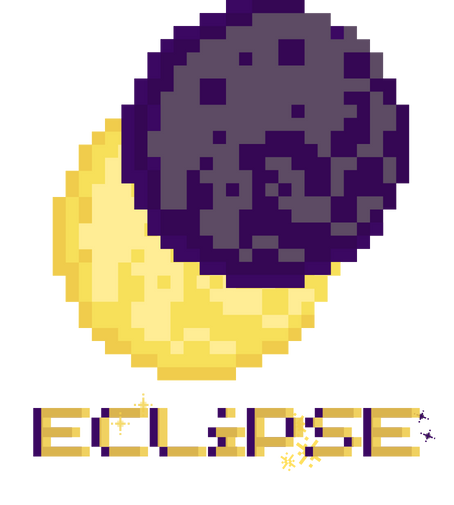

 

# Eclipse - Command Your Army in a Battle of Light and Darkness

[Now available on itch.io](https://pots-and-pans.itch.io/eclipse)

Deploy hidden-rank warriors, master tactical deception, and capture the enemy Crystal in this turn-based strategy game.
Command an army of 40 units in cosmic warfare against the Darkness or challenge friends in LAN multiplayer.

### A game of Imperfect Information

*The battlefield lies shrouded in mystery. Every piece conceals its true power. One wrong move could cost you everything.*

Light vs Shadow - which side will prevail?

## Bug Reports & Feature Requests

Please check [existing issues](https://github.com/vlshields/Eclipse/issues) before submitting new ones. When reporting bugs, include your operating system and Eclipse version as well as Screenshots or error messages if applicable.

## Acknowledgements

- **Engine:** Built with [LÖVE](https://love2d.org/)
- **Graphics:** Created [Aseprite](https://www.aseprite.org/) and LÖVE's graphics API
- **Audio:** Composed using the [ChucK programming language](https://chuck.stanford.edu/)
- **The Players:** Thank you to everyone who has tested Eclipse, even if it was for just 5 minutes. You have made this project possible! ❤️

---

*Copyright (C) 2025 Vince Shields*  
*Licensed under GPL-3.0 - see [LICENSE](LICENSE) file for details*  
*[Source](https://github.com/vlshields/Eclipse/releases/)*
